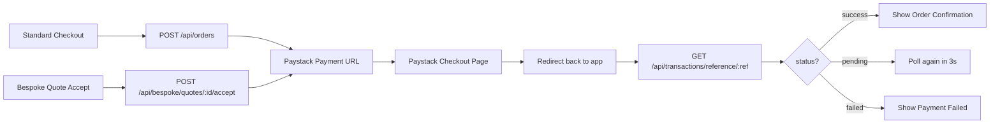

# Qlozet Frontend — Orders & Checkout Flow

> **Audience**: Frontend engineers implementing the order experience on the Qlozet shopping app (Next.js web + Flutter mobile).
> **Base URL**: `{{API_BASE}}/api` (e.g. `https://api.qlozet.app/api`)
> **Auth**: All authenticated endpoints require `Authorization: Bearer <access_token>` header.

---

## Table of Contents

1. [Flow Overview](#1-flow-overview)
2. [Standard Checkout Flow](#2-standard-checkout-flow)
3. [Bespoke Order Flow](#3-bespoke-order-flow)
4. [Paystack Integration](#4-paystack-integration)
5. [Payment Verification](#5-payment-verification)
6. [My Orders Screen](#6-my-orders-screen)
7. [Order Detail Screen](#7-order-detail-screen)
8. [Transaction History](#8-transaction-history)
9. [UI State Machine](#9-ui-state-machine)
10. [Error Handling](#10-error-handling)
11. [Code Examples](#11-code-examples)

---

## 1. Flow Overview

There are **two paths** to creating an order:



Both paths produce the **same response shape** and follow the **same Paystack payment flow**.

---

## 2. Standard Checkout Flow

### Step 1: Create Order

```
POST /api/orders
```

**Headers:**
```
Authorization: Bearer <access_token>
Content-Type: application/json
```

**Request Body:**
```json
{
  "items": [
    {
      "product_id": "665abc123def456ghi789jkl",
      "note": "Please add extra buttons",
      "selections": {
        "color_variant_selections": [
          {
            "color_variant_id": "665abc...",
            "size": "L",
            "quantity": 1
          }
        ],
        "fabric_selections": [
          {
            "fabric_id": "665def...",
            "yardage": 3.5,
            "quantity": 1
          }
        ],
        "style_selections": [
          {
            "style_id": "665ghi..."
          }
        ],
        "accessory_selections": [
          {
            "accessory_id": "665jkl...",
            "variant_id": "665mno...",
            "quantity": 2
          }
        ]
      }
    }
  ]
}
```

> [!IMPORTANT]
> **All selection arrays are optional.** Only include the selections relevant to the product kind:
> - **Clothing**: typically `color_variant_selections` + optionally `fabric_selections`, `style_selections`, `accessory_selections`
> - **Fabric**: `fabric_selections` (with `yardage`)
> - **Accessory**: `accessory_selections` (with `variant_id` for size/color)

**Success Response (201):**
```json
{
  "message": "Order created successfully. Redirect to payment.",
  "data": {
    "order": {
      "_id": "665xyz...",
      "reference": "QLOZ-ORD-20260608-AB12CD34",
      "customer": "665cust...",
      "type": "standard",
      "items": [
        {
          "product": "665abc...",
          "business": "665bus...",
          "color_variant_selections": [...],
          "fabric_selections": [...],
          "style_selections": [...],
          "accessory_selections": [...],
          "note": "Please add extra buttons"
        }
      ],
      "subtotal": 48000,
      "shipping_fee": 0,
      "total": 52000,
      "status": "pending",
      "createdAt": "2026-06-08T13:00:00.000Z"
    },
    "transaction": {
      "reference": "QLOZ-TRX-20260608-EF56GH78",
      "amount": 52000,
      "status": "pending"
    },
    "payment": {
      "authorization_url": "https://checkout.paystack.com/abc123xyz",
      "access_code": "abc123xyz",
      "reference": "QLOZ-TRX-20260608-EF56GH78"
    }
  }
}
```

### Step 2: Redirect to Paystack

Use the `payment.authorization_url` from the response:

```typescript
// Web (Next.js)
window.location.href = response.data.payment.authorization_url;

// Mobile (Flutter)
// Open in WebView — see Paystack Integration section below
```

### Step 3: Handle Paystack Return

Paystack redirects to: `{{FRONTEND_URL}}/payment/verify?reference=QLOZ-TRX-20260608-EF56GH78`

### Step 4: Verify Payment

See [Payment Verification](#5-payment-verification) below.

---

## 3. Bespoke Order Flow

When a customer accepts a bespoke quote, it follows the **same pattern** as standard checkout:

```
POST /api/bespoke/quotes/:quoteId/accept
```

**Request:** No body needed.

**Response (same shape as standard):**
```json
{
  "message": "Quote accepted. Redirect to payment.",
  "data": {
    "order": {
      "_id": "665xyz...",
      "reference": "QLOZ-ORD-20260608-XY99ZZ00",
      "type": "bespoke",
      "bespoke_design": "665des...",
      "bespoke_quote": "665quo...",
      "items": [...],
      "subtotal": 40000,
      "shipping_fee": 0,
      "total": 40000,
      "status": "pending"
    },
    "transaction": {
      "reference": "QLOZ-TRX-20260608-PP11QQ22",
      "amount": 40000,
      "status": "pending"
    },
    "payment": {
      "authorization_url": "https://checkout.paystack.com/def456uvw",
      "access_code": "def456uvw",
      "reference": "QLOZ-TRX-20260608-PP11QQ22"
    }
  }
}
```

> [!TIP]
> Both the web and Flutter apps can use the **exact same payment verification logic** for standard and bespoke orders. The only difference is the initial trigger endpoint.

---

## 4. Paystack Integration

### Web (Next.js)

```typescript
// After POST /api/orders or POST /api/bespoke/quotes/:id/accept

const handleCheckout = async () => {
  setLoading(true);
  try {
    const res = await apiFetch('/orders', {
      method: 'POST',
      body: JSON.stringify({ items: cartItems }),
    });

    // Store reference for verification after redirect
    sessionStorage.setItem('pending_order_ref', res.data.transaction.reference);
    sessionStorage.setItem('pending_order_id', res.data.order._id);

    // Redirect to Paystack
    window.location.href = res.data.payment.authorization_url;
  } catch (err) {
    showError(err.message);
  } finally {
    setLoading(false);
  }
};
```

**Return page** (`/payment/verify`):
```typescript
// app/payment/verify/page.tsx
'use client';
import { useSearchParams, useRouter } from 'next/navigation';
import { useEffect, useState } from 'react';

export default function PaymentVerifyPage() {
  const params = useSearchParams();
  const router = useRouter();
  const reference = params.get('reference');
  const [status, setStatus] = useState<'verifying' | 'success' | 'failed'>('verifying');

  useEffect(() => {
    if (!reference) return;
    verifyPayment(reference);
  }, [reference]);

  const verifyPayment = async (ref: string) => {
    let attempts = 0;
    const maxAttempts = 10;

    const poll = async () => {
      const res = await apiFetch(`/transactions/reference/${ref}`);
      if (res.status === 'success') {
        setStatus('success');
        // Clear cart on success
        clearCart();
      } else if (res.status === 'failed') {
        setStatus('failed');
      } else if (attempts < maxAttempts) {
        attempts++;
        setTimeout(poll, 3000); // Poll every 3 seconds
      } else {
        setStatus('failed'); // Timed out
      }
    };
    poll();
  };

  return (
    <div>
      {status === 'verifying' && <Spinner message="Verifying payment..." />}
      {status === 'success' && <OrderConfirmation />}
      {status === 'failed' && <PaymentFailed onRetry={() => router.push('/cart')} />}
    </div>
  );
}
```

### Mobile (Flutter/Dart)

```dart
import 'package:flutter/material.dart';
import 'package:webview_flutter/webview_flutter.dart';

class PaystackWebViewScreen extends StatefulWidget {
  final String paymentUrl;
  final void Function(String reference) onComplete;
  final VoidCallback onCancel;

  const PaystackWebViewScreen({
    super.key,
    required this.paymentUrl,
    required this.onComplete,
    required this.onCancel,
  });

  @override
  State<PaystackWebViewScreen> createState() => _PaystackWebViewScreenState();
}

class _PaystackWebViewScreenState extends State<PaystackWebViewScreen> {
  late final WebViewController _controller;

  @override
  void initState() {
    super.initState();
    _controller = WebViewController()
      ..setJavaScriptMode(JavaScriptMode.unrestricted)
      ..setNavigationDelegate(
        NavigationDelegate(
          onNavigationRequest: (NavigationRequest request) {
            // Detect Paystack redirect back to callback URL
            if (request.url.contains('/payment/verify')) {
              final uri = Uri.parse(request.url);
              final reference = uri.queryParameters['reference'] ?? '';
              widget.onComplete(reference);
              return NavigationDecision.prevent;
            }
            return NavigationDecision.navigate;
          },
          onWebResourceError: (_) => widget.onCancel(),
        ),
      )
      ..loadRequest(Uri.parse(widget.paymentUrl));
  }

  @override
  Widget build(BuildContext context) {
    return Scaffold(
      appBar: AppBar(
        title: const Text('Complete Payment'),
        leading: IconButton(
          icon: const Icon(Icons.close),
          onPressed: widget.onCancel,
        ),
      ),
      body: WebViewWidget(controller: _controller),
    );
  }
}
```

**Usage in Flutter:**
```dart
// After receiving payment response from API
void _handleCheckout(Map<String, dynamic> paymentData) {
  final authUrl = paymentData['payment']['authorization_url'] as String;
  final txnRef = paymentData['transaction']['reference'] as String;

  Navigator.push(
    context,
    MaterialPageRoute(
      builder: (_) => PaystackWebViewScreen(
        paymentUrl: authUrl,
        onComplete: (reference) {
          Navigator.pop(context);
          _verifyPayment(reference);
        },
        onCancel: () {
          Navigator.pop(context);
          ScaffoldMessenger.of(context).showSnackBar(
            const SnackBar(content: Text('Payment cancelled')),
          );
        },
      ),
    ),
  );
}

---

### Flutter — Payment Verification

```dart
import 'dart:async';
import 'package:http/http.dart' as http;
import 'dart:convert';

Future<String> verifyPayment(String reference, String accessToken) async {
  const maxAttempts = 10;
  const pollInterval = Duration(seconds: 3);

  for (var i = 0; i < maxAttempts; i++) {
    final response = await http.get(
      Uri.parse('$apiBase/transactions/reference/$reference'),
      headers: {'Authorization': 'Bearer $accessToken'},
    );

    if (response.statusCode == 200) {
      final data = jsonDecode(response.body);
      final status = data['status'] as String;

      if (status == 'success') return 'success';
      if (status == 'failed') return 'failed';
    }

    await Future.delayed(pollInterval);
  }

  return 'timeout';
}
```

---

## 5. Payment Verification

### Endpoint

```
GET /api/transactions/reference/:reference
```

**Response:**
```json
{
  "_id": "665txn...",
  "reference": "QLOZ-TRX-20260608-EF56GH78",
  "type": "debit",
  "amount": 52000,
  "status": "success",
  "channel": "checkout",
  "currency": "NGN",
  "description": "Order payment for order QLOZ-ORD-20260608-AB12CD34",
  "metadata": {
    "order_reference": "QLOZ-ORD-20260608-AB12CD34",
    "items_count": 1,
    "paystack": {
      "authorization_url": "...",
      "access_code": "...",
      "reference": "..."
    }
  },
  "createdAt": "2026-06-08T13:00:00.000Z"
}
```

### Transaction Status Meanings

| `status` | What happened | Frontend action |
|----------|---------------|-----------------|
| `pending` | Payment not yet confirmed by Paystack | Poll again in 3 seconds |
| `success` | Payment confirmed ✅ | Show confirmation, clear cart |
| `failed` | Payment was declined | Show error, offer retry |
| `reversed` | Refund was processed | Show refund confirmation |

### Polling Strategy

```typescript
async function waitForPayment(reference: string, maxWaitMs = 30000): Promise<string> {
  const startTime = Date.now();

  while (Date.now() - startTime < maxWaitMs) {
    const txn = await apiFetch(`/transactions/reference/${reference}`);

    if (txn.status === 'success') return 'success';
    if (txn.status === 'failed') return 'failed';

    // Still pending — wait 3s and retry
    await new Promise(resolve => setTimeout(resolve, 3000));
  }

  return 'timeout'; // Show "Payment is being processed" message
}
```

> [!IMPORTANT]
> **Flutter (Dart):** Use `flutter_secure_storage` to store tokens instead of `SharedPreferences`. Never store access tokens in plain `SharedPreferences`.

> [!NOTE]
> The webhook (`POST /api/webhook/paystack`) is what actually confirms the payment on the backend. The polling above just reads the result. If polling times out, show "Your payment is being processed. Check your orders for updates." — the webhook will still process it.

---

## 6. My Orders Screen

### List All Orders

```
GET /api/orders/customer?page=1&size=10
```

**Optional filters:**
| Param | Values | Default |
|-------|--------|---------|
| `page` | `1`, `2`, ... | `1` |
| `size` | `5`, `10`, `20` | `10` |
| `status` | `pending`, `in_review`, `processing`, `in_transit`, `completed`, `cancelled`, `returned` | all |

**Response:**
```json
{
  "total_items": 12,
  "data": [
    {
      "_id": "665ord...",
      "reference": "QLOZ-ORD-20260608-AB12CD34",
      "type": "standard",
      "status": "processing",
      "total": 52000,
      "items": [
        {
          "product": {
            "_id": "665abc...",
            "name": "Modern Agbada",
            "images": ["https://res.cloudinary.com/.../img.jpg"],
            "base_price": 45000
          },
          "business": "665bus...",
          "color_variant_selections": [...],
          "note": "Extra buttons"
        }
      ],
      "customer": {
        "_id": "665cust...",
        "firstName": "Kemi",
        "lastName": "Ayomi",
        "email": "kemi@example.com"
      },
      "createdAt": "2026-06-08T13:00:00.000Z"
    },
    {
      "_id": "665ord2...",
      "reference": "QLOZ-ORD-20260610-XX99YY00",
      "type": "bespoke",
      "bespoke_design": "665des...",
      "bespoke_quote": "665quo...",
      "status": "pending",
      "total": 40000,
      "items": [...],
      "createdAt": "2026-06-10T09:00:00.000Z"
    }
  ],
  "total_pages": 2,
  "current_page": 1,
  "has_next_page": true,
  "has_previous_page": false,
  "page_size": 10
}
```

### Order List Card — Rendering Logic

```tsx
function OrderCard({ order }) {
  const isBespoke = order.type === 'bespoke';

  return (
    <Card>
      {/* Badge */}
      <Badge color={isBespoke ? 'purple' : 'blue'}>
        {isBespoke ? '✂️ Bespoke' : '🛒 Standard'}
      </Badge>

      {/* Status */}
      <StatusBadge status={order.status} />

      {/* Product preview */}
      {order.items.map(item => (
        <ProductPreview
          key={item.product._id}
          name={item.product.name}
          image={item.product.images?.[0]}
          price={item.product.base_price}
        />
      ))}

      {/* Totals */}
      <TotalRow>
        <span>Total</span>
        <span>₦{order.total.toLocaleString()}</span>
      </TotalRow>

      {/* Reference */}
      <Text muted>{order.reference}</Text>
      <Text muted>{formatDate(order.createdAt)}</Text>

      {/* Actions */}
      {order.status === 'pending' && (
        <Button onClick={() => retryPayment(order)}>Complete Payment</Button>
      )}
    </Card>
  );
}
```

### Status Tab Filters

```tsx
const ORDER_TABS = [
  { label: 'All', value: undefined },
  { label: 'Pending', value: 'pending' },
  { label: 'Processing', value: 'processing' },
  { label: 'In Transit', value: 'in_transit' },
  { label: 'Completed', value: 'completed' },
  { label: 'Cancelled', value: 'cancelled' },
];

// Fetch with filter:
const fetchOrders = (status?: string) =>
  apiFetch(`/orders/customer?page=${page}&size=10${status ? `&status=${status}` : ''}`);
```

---

## 7. Order Detail Screen

There is no dedicated `GET /orders/:id` endpoint. Use the order data from the list response. For bespoke orders, fetch additional detail:

| Order Type | Additional API Calls |
|------------|---------------------|
| `standard` | None needed — list response has all data |
| `bespoke` | `GET /api/bespoke/designs/:bespoke_design` for design images + quote details |

```typescript
// For bespoke orders, enrich with design data:
if (order.type === 'bespoke' && order.bespoke_design) {
  const designData = await apiFetch(`/bespoke/designs/${order.bespoke_design}`);
  // designData.data.design → design images, fabric info
  // designData.data.quotes → accepted quote with line items breakdown
}
```

---

## 8. Transaction History

### List Customer Transactions

```
GET /api/transactions/customer?page=1&size=10
```

**Optional filter:** `?status=success` or `pending` or `failed` or `reversed`

**Response:**
```json
{
  "total_items": 8,
  "data": [
    {
      "_id": "665txn...",
      "reference": "QLOZ-TRX-20260608-EF56GH78",
      "type": "debit",
      "amount": 52000,
      "status": "success",
      "channel": "checkout",
      "currency": "NGN",
      "description": "Order payment for order QLOZ-ORD-20260608-AB12CD34",
      "metadata": {
        "order_reference": "QLOZ-ORD-20260608-AB12CD34",
        "items_count": 1
      },
      "createdAt": "2026-06-08T13:00:00.000Z"
    }
  ],
  "total_pages": 1,
  "current_page": 1
}
```

### Transaction Types

| `type` | Display | Icon |
|--------|---------|------|
| `debit` | "Payment" | 💳 |
| `credit` | "Refund" / "Payout" | 💰 |
| `fund` | "Wallet Top-up" | 🏦 |
| `refund` | "Refund" | ↩️ |

### Transaction Channels

| `channel` | Meaning |
|-----------|---------|
| `checkout` | Order payment |
| `wallet_topup` | Wallet funding |
| `refund` | Refund from cancelled order |
| `payout` | Vendor payout (not visible to customers) |

---

## 9. UI State Machine

### Order Status → UI Mapping

| Status | Badge Color | Icon | Description | Customer Actions |
|--------|-------------|------|-------------|-----------------|
| `pending` | 🟡 Yellow | ⏳ | Awaiting payment | "Complete Payment" button |
| `in_review` | 🟠 Orange | 🔍 | Under review | None — wait |
| `processing` | 🔵 Blue | ⚙️ | Being prepared | None — wait |
| `in_transit` | 🟣 Purple | 🚚 | On the way | "Track Order" (if tracking_number exists) |
| `completed` | 🟢 Green | ✅ | Delivered | "Rate Products", "Reorder" |
| `cancelled` | 🔴 Red | ❌ | Cancelled | "View Refund" |
| `returned` | ⚪ Gray | ↩️ | Returned | None |

### Status Badge Component

```tsx
const STATUS_CONFIG = {
  pending:     { color: '#F59E0B', bg: '#FEF3C7', label: 'Pending Payment' },
  in_review:   { color: '#EA580C', bg: '#FFF7ED', label: 'In Review' },
  processing:  { color: '#2563EB', bg: '#EFF6FF', label: 'Processing' },
  in_transit:  { color: '#7C3AED', bg: '#F5F3FF', label: 'In Transit' },
  completed:   { color: '#16A34A', bg: '#F0FDF4', label: 'Completed' },
  cancelled:   { color: '#DC2626', bg: '#FEF2F2', label: 'Cancelled' },
  returned:    { color: '#6B7280', bg: '#F9FAFB', label: 'Returned' },
};

function OrderStatusBadge({ status }: { status: string }) {
  const config = STATUS_CONFIG[status] || STATUS_CONFIG.pending;
  return (
    <span style={{
      color: config.color,
      backgroundColor: config.bg,
      padding: '4px 12px',
      borderRadius: '20px',
      fontSize: '12px',
      fontWeight: 600,
    }}>
      {config.label}
    </span>
  );
}
```

### Order Type Badge

```tsx
function OrderTypeBadge({ type }: { type: string }) {
  if (type === 'bespoke') {
    return <Badge icon="✂️" color="purple">Bespoke</Badge>;
  }
  return <Badge icon="🛒" color="blue">Standard</Badge>;
}
```

---

## 10. Error Handling

### Common Order Errors

| Error | Status | When | Frontend Response |
|-------|--------|------|-------------------|
| `"Validation error"` | 400 | Missing required selections | Highlight missing fields in cart |
| `"Product not found"` | 404 | Product was deleted/deactivated | Remove from cart, show notice |
| `"Insufficient stock"` | 400 | Variant out of stock | Show "Out of stock", disable checkout |
| `"Address not found"` | 400 | No shipping address saved | Redirect to address form |
| `"Cannot accept a quote with status..."` | 400 | Quote already accepted/expired | Refresh quote list |
| `"This quote has expired"` | 400 | 7-day expiry passed | Show expired badge, disable accept |
| `"Maximum 5 vendors per design"` | 400 | Vendor limit reached | Disable "Add more vendors" |

### Pre-Checkout Validation (Client-Side)

Before calling `POST /orders`, validate:

```typescript
function validateBeforeCheckout(cart: CartItem[]): string | null {
  if (cart.length === 0) return 'Cart is empty';

  for (const item of cart) {
    if (item.kind === 'clothing' && !item.selectedVariant) {
      return `Please select a size/color for "${item.title}"`;
    }
    if (item.kind === 'fabric' && (!item.yardage || item.yardage < 0.1)) {
      return `Please enter yardage for "${item.title}"`;
    }
  }

  return null; // All good
}
```

---

## 11. Code Examples

### Complete Checkout Flow (Web)

```typescript
// hooks/useCheckout.ts
import { useState } from 'react';
import { useApp } from '@/context/AppContext';

export function useCheckout() {
  const { cart, clearCart } = useApp();
  const [loading, setLoading] = useState(false);
  const [error, setError] = useState<string | null>(null);

  const checkout = async () => {
    setLoading(true);
    setError(null);

    try {
      // 1. Build order items from cart
      const items = cart.map(item => ({
        product_id: item.id,
        note: item.note || undefined,
        selections: buildSelections(item),
      }));

      // 2. Create order
      const res = await apiFetch('/orders', {
        method: 'POST',
        body: JSON.stringify({ items }),
      });

      // 3. Store references for after-payment verification
      sessionStorage.setItem('checkout_txn_ref', res.data.transaction.reference);
      sessionStorage.setItem('checkout_order_ref', res.data.order.reference);

      // 4. Redirect to Paystack
      window.location.href = res.data.payment.authorization_url;
    } catch (err: any) {
      setError(err.message || 'Failed to create order');
    } finally {
      setLoading(false);
    }
  };

  return { checkout, loading, error };
}

function buildSelections(item: CartItem) {
  const selections: any = {};

  if (item.kind === 'clothing' && item.selectedVariant) {
    selections.color_variant_selections = [{
      color_variant_id: item.selectedVariant.id,
      size: item.size,
      quantity: item.quantity,
    }];
  }

  if (item.kind === 'fabric') {
    selections.fabric_selections = [{
      fabric_id: item.id,
      yardage: item.yardage,
      quantity: item.quantity,
    }];
  }

  if (item.kind === 'accessory' && item.selectedVariant) {
    selections.accessory_selections = [{
      accessory_id: item.id,
      variant_id: item.selectedVariant.id,
      quantity: item.quantity,
    }];
  }

  return selections;
}
```

### Complete Bespoke Accept Flow

```typescript
// hooks/useBespokeCheckout.ts
export function useBespokeCheckout() {
  const [loading, setLoading] = useState(false);

  const acceptQuote = async (quoteId: string) => {
    setLoading(true);
    try {
      const res = await apiFetch(`/bespoke/quotes/${quoteId}/accept`, {
        method: 'POST',
      });

      // Same redirect flow as standard checkout
      sessionStorage.setItem('checkout_txn_ref', res.data.transaction.reference);
      sessionStorage.setItem('checkout_order_ref', res.data.order.reference);

      window.location.href = res.data.payment.authorization_url;
    } catch (err: any) {
      if (err.message.includes('expired')) {
        showToast('This quote has expired. Please request a new quote.');
      } else {
        showToast(err.message);
      }
    } finally {
      setLoading(false);
    }
  };

  return { acceptQuote, loading };
}
```

### Orders List with Infinite Scroll

```typescript
// hooks/useOrders.ts
export function useOrders(statusFilter?: string) {
  const [orders, setOrders] = useState<Order[]>([]);
  const [page, setPage] = useState(1);
  const [hasMore, setHasMore] = useState(true);
  const [loading, setLoading] = useState(false);

  const fetchOrders = async (reset = false) => {
    const currentPage = reset ? 1 : page;
    setLoading(true);

    const params = new URLSearchParams({
      page: String(currentPage),
      size: '10',
    });
    if (statusFilter) params.set('status', statusFilter);

    const res = await apiFetch(`/orders/customer?${params}`);

    setOrders(prev => reset ? res.data : [...prev, ...res.data]);
    setHasMore(res.has_next_page);
    setPage(currentPage + 1);
    setLoading(false);
  };

  useEffect(() => {
    fetchOrders(true);
  }, [statusFilter]);

  return { orders, loading, hasMore, loadMore: () => fetchOrders() };
}
```

---

## Quick Reference

| Action | Endpoint | Method |
|--------|----------|--------|
| Create standard order | `/orders` | `POST` |
| Accept bespoke quote → order | `/bespoke/quotes/:id/accept` | `POST` |
| List my orders | `/orders/customer?page=1&size=10` | `GET` |
| Filter orders by status | `/orders/customer?status=processing` | `GET` |
| Verify payment | `/transactions/reference/:ref` | `GET` |
| List my transactions | `/transactions/customer?page=1&size=10` | `GET` |
| Cancel order (vendor only) | `/orders/cancel/:reference` | `PATCH` |
